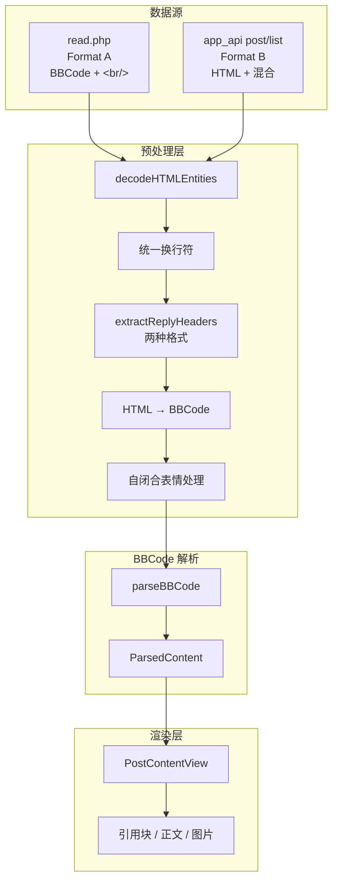

# 回复 UI 与解析方案设计

**版本**：1.0  
**日期**：2026-03-14  
**状态**：草案

---

## 一、问题与目标

### 1.1 现状问题

1. **同一接口内就有多种 reply 格式**：即便都是 `app_api post/list`，不同客户端（iOS vs Android）发帖会产生不同 content 结构
   - **B1 (iOS)**：`<b>Reply to [pid]...Post by [uid]X[/uid] (date)</b>` 开头，无 `[quote]` 包裹
   - **B2 (Android)**：`[quote][pid]...<b>Post by [uid]X[/uid] (date):</b>被引用内容[/quote]` 包裹
   - **read.php**（未登录）：与 B1 类似但用 `[b]` 不用 `<b>`

2. **回复块（quote）解析不完整**
   - 引用块内 `Reply <b>Post by X (date):</b>` 的 HTML 未正确渲染
   - NGA 表情 `[s:a2:偷吃]` 等自闭合标签显示为原始文本

3. **UI/UX 有待现代化**
   - 回复卡片视觉层次不够清晰
   - 楼中楼、引用链等复杂结构缺乏统一呈现方式

### 1.2 设计目标

- **解析**：两种格式统一解析为同一中间表示，再渲染
- **UI**：符合现代论坛 App 的视觉与交互规范
- **可扩展**：支持未来楼中楼、嵌套引用等能力

---

## 二、NGA 两种 content 格式详解

### 2.1 格式 A：read.php / MNGA（未登录）

**来源**：`read.php` POST → `parseScriptVarJSON` → `data.__R`

| 项目 | 格式 |
|------|------|
| 换行 | `&lt;br/&gt;` 或 `&lt;br&gt;` |
| 引用头 | `[b]Reply to [pid=374015111,19025853,1]Reply[/pid] Post by [uid=60737398]rockallen007[/uid] (2019-10-31 23:29)[/b]` |
| 表情 | `[s:a2:偷吃]`、`[s:ac:羡慕]` 等自闭合 |
| BBCode | `[b]`、`[url=...]`、`[img]`、`[quote]`、`[color]`、`[size]` |
| 结构 | 楼中楼在 `comment` 数组，content 内嵌引用块 |

**示例 content**：
```
[b]Reply to [pid=374015111,19025853,1]Reply[/pid] Post by [uid=60737398]rockallen007[/uid] (2019-10-31 23:29)[/b]&lt;br/&gt;&lt;br/&gt;1. 此贴并没冲水(请好好看说明)&lt;br/&gt;2. 你申请编辑权限这里不负责受理...
```

### 2.2 app_api post/list 内的两种格式（同一接口！）

**来源**：`app_api.php?__lib=post&__act=list` → `result[]`  
**关键发现**：同一接口内，不同客户端发帖会产生不同 content 结构，需都解析成同一展示。

#### 2.2.1 格式 B1：iOS 客户端（无 `[quote]` 包裹）

| 项目 | 格式 |
|------|------|
| 特征 | `from_client: "7 iOS"`，引用头直接放在 content 开头 |
| 引用头 | `<b>Reply to [pid=861068776,46366649,1]Reply[/pid] Post by [uid=66951445]兵败如山倒desuwa[/uid] (2026-03-14 02:43)</b>` |
| 换行 | `<br/>` |
| 结构 | **无** `[quote]` 包裹，整条 content 就是「引用头 + 换行 + 回复正文」 |

**示例**：
```
<b>Reply to [pid=861068776,46366649,1]Reply[/pid] Post by [uid=66951445]兵败如山倒desuwa[/uid] (2026-03-14 02:43)</b><br/><br/>这红配绿本身就有问题...
```

#### 2.2.2 格式 B2：Android 客户端（有 `[quote]` 包裹）

| 项目 | 格式 |
|------|------|
| 特征 | `from_client: "8 Android"`，引用内容用 `[quote]...[/quote]` 包裹 |
| 引用头 | `[quote][pid=861068824,46366649,1]Reply[/pid] <b>Post by [uid=60194256]我不是春学家[/uid] (2026-03-14 02:45):</b><br/><br/>` |
| 换行 | `<br/>` |
| 结构 | `[quote][pid]... <b>Post by [uid]... (date):</b><br/><br/>被引用正文[/quote]` + 回复正文 |

**示例**：
```
[quote][pid=861068824,46366649,1]Reply[/pid] <b>Post by [uid=60194256]我不是春学家[/uid] (2026-03-14 02:45):</b><br/><br/>这红配绿本身就有问题...[/quote]说起红配绿，我还挺喜欢...
```

### 2.3 read.php 也返回两种格式（已验证）

**来源**：`read.php` → `data.__R`（未登录）  
**结论**：read.php 与 app_api 相同，**同一接口内也有 B1、B2 两种格式**，取决于发帖客户端（iOS / Android），而非接口本身。

| 格式 | read.php 中的表现 | app_api 中的表现 |
|------|-------------------|------------------|
| **B1** | `[b]Reply to [pid]...Post by [uid]X[/uid] (date)[/b]<br/><br/>` + 正文 | `<b>Reply to [pid]...Post by [uid]X[/uid] (date)</b><br/><br/>` + 正文 |
| **B2** | `[quote][pid]...[b]Post by [uid]X[/uid] (date):[/b]<br/><br/>` 被引用内容 `[/quote]` + 正文 | `[quote][pid]...<b>Post by [uid]X[/uid] (date):</b><br/><br/>` 被引用内容 `[/quote]` + 正文 |

**read.php 与 app_api 的差异**：仅**粗体标签**不同  
- read.php：`[b]` `[/b]`（BBCode）  
- app_api：`<b>` `</b>`（HTML）

### 2.4 格式归纳（两接口 × 两种结构）

| 维度 | B1（无 [quote]） | B2（有 [quote]） |
|------|------------------|------------------|
| 发帖端 | iOS / 网页 等 | Android 等 |
| 粗体 | read: `[b]`，app_api: `<b>` | 同左 |
| pid/uid | ✅ 均有 | ✅ 均有 |
| 被引用内容 | ❌ 无 | ✅ 有 |
| 引用头位置 | content 最前 | `[quote]` 内最前 |

---

## 三、统一解析架构

### 3.1 整体流程

```
┌─────────────────┐     ┌─────────────────┐     ┌──────────────────────┐
│   Raw Content   │     │  Normalizer     │     │  Unified Content     │
│   (String)      │ ──► │  (format detect │ ──► │  Model               │
│                 │     │   + transform)  │     │  (ParsedContent)     │
└─────────────────┘     └─────────────────┘     └──────────────────────┘
        │                         │                          │
        │                         │                          ▼
        │                         │                 ┌──────────────────────┐
        │                         │                 │  PostContentView     │
        │                         │                 │  (SwiftUI 渲染)      │
        │                         │                 └──────────────────────┘
        ▼                         ▼
   read.php / app_api        1. decodeHTMLEntities
   (两种格式)                 2. 统一换行 (\n)
                             3. 识别并标准化引用头
                             4. HTML → BBCode
```

### 3.2 统一内容模型（ParsedContent）

将解析结果抽象为可渲染的树形结构，而非平铺 segment 数组：

```
ParsedContent
├── blocks: [ContentBlock]
│   ├── .paragraph([InlineSegment])     // 普通段落
│   ├── .quote(ReplyHeader?, [ContentBlock])  // 引用块（可嵌套）
│   └── .image(url)
│
InlineSegment
├── .text(String)
├── .bold(String)
├── .link(url, text)
└── .emoji(placeholder)   // [s:xx:yy] 占位或图片

ReplyHeader  // 引用头元数据（结构化，便于 UI 展示）
├── repliedToPid: Int?
├── repliedToUid: Int?
├── repliedToAuthor: String
└── repliedToDate: String
```

### 3.3 引用头标准化（B1/B2 × [b]/<b> → 同一 ReplyHeader）

| 结构 | 识别规则 | 粗体标签 |
|------|----------|----------|
| **B1** | content 开头匹配 `Reply to [pid=...]...Post by [uid=...]X[/uid] (date)` | read: `[b]...[/b]`，app_api: `<b>...</b>` |
| **B2** | `[quote]` 内匹配 `[pid=...]...Post by [uid=...]X[/uid] (date):` | 同上 |

**预处理**：`normalizeSimpleHTML` 已把 `<b>` → `[b]`，故 app_api 的 `<b>` 会先被转成 `[b]`，后续可统一按 BBCode 解析。

**重要区别**：
- **B1**：无 `[quote]`，引用头后直接是**回复正文**，无被引用内容 → **需用 pid 补全**
- **B2**：有 `[quote]`，`[/quote]` 前是被引用内容，`[/quote]` 后是回复正文

### 3.4 B1 引用内容补全（pid 查找）

B1 格式无被引用正文，需根据引用头中的 `pid` 获取：

1. **当前页命中**：在已加载的 `posts` 中按 `pid` 查找，取出 `content` 作为被引用内容
2. **不在当前页**：调用 read.php，传 `pid` 参数（用法同 tid）拉取该楼层 → 解析 `content` 作为被引用内容

**策略**：在 `normalizeSimpleHTML` 之后，先做「引用头提取与替换」：
1. 检测上述两种模式
2. 提取结构化 ReplyHeader
3. 用占位符 `\0REPLY_HEADER\0` 替换原文，并在旁路保存 header
4. 后续 parseBBCode 将占位符识别为 `.quote(ReplyHeader, body)` 的起始

---

## 四、解析 Pipeline 细化

### 4.1 预处理阶段（顺序执行）

| 步骤 | 输入 | 输出 | 说明 |
|------|------|------|------|
| 1 | raw | - | decodeHTMLEntities |
| 2 | - | - | `<br/>`/`<br>` → `\n` |
| 3 | - | - | normalizeSimpleHTML（`<b>`→`[b]` 等） |
| 4 | - | - | **新增**：extractAndReplaceReplyHeaders（两种格式） |
| 5 | - | - | 自闭合表情 `[s:xx:yy]` 识别并替换为占位 |

### 4.2 BBCode 解析阶段（现有逻辑增强）

- 保持现有 `parseBBCode` 主流程
- 增加对 `[pid=...]`、`[uid=...]` 的语义解析：转为可点击「跳转到某楼」的 link，或至少提取出结构化信息
- 占位符 `\0REPLY_HEADER\0` 在解析时生成 `.quote(header, body)`

### 4.3 输出统一

- 当前 `PostContentSegment` 可保留，用于简单场景
- 新增 `ParsedContent` / `ContentBlock` 用于复杂 quote 结构，便于 UI 分层渲染

---

## 五、UI/UX 设计

### 5.1 现代化原则

- **层次分明**：主楼、楼中楼、引用块有明确视觉区分
- **可读性**：字号、行距、背景对比符合 WCAG 建议
- **触控友好**：引用块、链接、楼层号易于点击
- **一致性**：与系统风格（iOS Human Interface）协调

### 5.2 回复卡片结构（PostDetailView 层级）

```
┌─────────────────────────────────────────────────────────────┐
│ [头像] 用户名 →                                              │
│        级别 | 威望 | 发帖                                     │
├─────────────────────────────────────────────────────────────┤
│  #楼层                                                       │
│                                                              │
│  ┌─ 引用块 ─────────────────────────────────────────────┐   │
│  │  Reply  Post by 某人 (日期)  [可点击跳转]                │   │
│  │  ─────────────────────────────────────────────────   │   │
│  │  被引用的内容...（小号字、次要色）                        │   │
│  └──────────────────────────────────────────────────────┘   │
│                                                              │
│  当前回复正文...                                              │
│  [图片]                                                       │
├─────────────────────────────────────────────────────────────┤
│  时间  [设备图标]  [礼物] [赞] [踩] [回复] [+]                │
└─────────────────────────────────────────────────────────────┘
```

### 5.3 设备图标（时间旁）

根据 API 返回的 `from_client` 显示发帖端：

| from_client 含 | 图标 |
|----------------|------|
| `iOS` | SF Symbol `apple.logo`（苹果图标） |
| `Android` | SF Symbol `square.grid.2x2`（应用网格，代表 Android 桌面） |
| 其他 / 缺失 | 默认占位（如 `iphone` 或隐藏） |

**数据来源**：post 的 `from_client` 字段（如 `"7 iOS"`、`"8 Android"`、`"0 /"`）。

### 5.4 引用块（quote）样式规范

| 元素 | 样式 |
|------|------|
| 容器 | 浅灰背景（如 `gray.opacity(0.08)`），左边框 3pt 强调色 |
| 引用头 | 加粗，可点击；点击跳转到被引用楼层 |
| 引用内容 | 字号略小（smallBody），secondary 色 |
| 内边距 | 12pt 左（含左边框），8pt 上下 |
| 圆角 | 0（或 4pt 与整体风格统一） |

### 5.5 交互

- 引用头「Post by 某人 (date)」可 tap → 滚动到对应楼层并高亮
- 楼层号 `#12` 可 tap → 复制楼层链接或跳转
- 图片支持点击预览（已有或可扩展）

---

## 六、实施阶段建议

> 可执行步骤见 **[REPLY_IMPLEMENTATION_PLAN.md](./REPLY_IMPLEMENTATION_PLAN.md)**。

### Phase 1：解析统一（优先）

1. 实现 `extractAndReplaceReplyHeaders`，支持 B1/B2 两种引用头格式
2. 扩展 `PostContentSegment` 或引入 `ReplyHeader` 结构
3. 确保 `[pid]`、`[uid]` 不显示为原始标签，至少转为可读文本
4. **B1 引用补全**：按 pid 查找——当前页 posts 优先；未命中则请求 read.php（传 pid，用法同 tid）拉取单楼

### Phase 2：UI 增强

1. 引用块内「引用头」独立一行、可点击
2. 整体间距、字号、颜色按 5.2–5.4 调整
3. 楼层号、时间等元数据视觉强化
4. **设备图标**：Post 模型增加 `fromClient`，时间旁显示 `apple.logo`（iOS）或 `square.grid.2x2`（Android）

### Phase 3：楼中楼与扩展

1. 若有 `comment` 数据，设计楼中楼 UI（缩进、折叠等）
2. NGA 表情可考虑渲染为图片（需 CDN 规则）
3. 长引用折叠/展开

---

## 七、风险与降级

| 风险 | 降级方案 |
|------|----------|
| 新引用头格式未识别 | 回退为纯文本展示，不解析为结构化 |
| 解析性能 | 首次解析可缓存，避免重复 parse |
| app_api 格式变化 | 通过 format hint 或采样检测，动态选择解析策略 |

---

## 八、附录

### A. 引用头正则/规则参考

**B1 / C**（`<b>` 或 `[b]`，Reply to 在前）：
```regex
(?:<b>|\[b\])Reply to \[pid=(\d+),[^]]+\]Reply\[/pid\] Post by \[uid=(\d+)\]([^\]]*)\[/uid\] \(([^)]+)\)(?:</b>|\[/b\])
```

**B2**（`[quote]` 内，Post by 在前）：
```regex
\[quote\]\[pid=(\d+),[^]]+\]Reply\[/pid\] <b>Post by \[uid=(\d+)\]([^\]]*)\[/uid\] \(([^)]+)\):</b>
```

注意：JSON 中 `</b>` 可能为 `<\/b>`，需兼容。

### B. 架构示意图

> 若 IDE 不支持 Mermaid 渲染，可访问 [Mermaid Live](https://mermaid.live) 粘贴下方代码预览。

#### 解析流水线



#### 两种结构 × 两接口 → 统一展示

```mermaid
flowchart LR
    subgraph B1 [ B1: 无[quote] ]
        B1R["read.php: [b]Reply to [pid]...[/b]"]
        B1A["app_api: &lt;b&gt;Reply to [pid]...&lt;/b&gt;"]
    end

    subgraph B2 [ B2: 有[quote] ]
        B2R["read.php: [quote][pid]...[b]Post by...[/b]...[/quote]"]
        B2A["app_api: [quote][pid]...&lt;b&gt;Post by...&lt;/b&gt;...[/quote]"]
    end

    subgraph U [ 统一输出 ]
        UO[引用块: ReplyHeader + 被引用内容 + 正文]
    end

    B1R --> U
    B1A --> U
    B2R --> U
    B2A --> U
```

#### 回复卡片 UI 布局

```mermaid
flowchart TB
    subgraph card [ PostDetailView ]
        H[头像 + 用户名 + 级别/威望/发帖]
        Q[引用块: 灰色背景 | 左边框 | Reply Post by X date]
        M[正文内容 + 图片]
        F[时间 | 点赞/踩 | 回复]
    end

    H --> Q --> M --> F
```

#### ASCII 简图（无 Mermaid 时）

```
  read.php ──────┐
                 ├──► Normalizer ──► parseBBCode ──► ParsedContent ──► PostContentView
  app_api ───────┘         │
                           ├ decodeHTMLEntities
                           ├ 统一换行
                           ├ 提取/标准化引用头 (Format A / B)
                           ├ HTML→BBCode
                           └ 自闭合表情 [s:xx:yy]

  回复卡片布局:
  ┌─────────────────────────────────────┐
  │ [头像] 用户名    级别|威望|发帖       │
  ├─────────────────────────────────────┤
  │ ┌─ 引用块 ────────────────────────┐ │
  │ │ Reply Post by X (date) [可点击]   │ │
  │ │ 被引用内容...                     │ │
  │ └─────────────────────────────────┘ │
  │ 正文内容...                          │
  ├─────────────────────────────────────┤
  │ 时间 📱  [礼物][赞][踩][回复][+]     │
  └─────────────────────────────────────┘
```

---

### C. 按 pid 获取单楼

read.php 支持 `pid` 参数，用法与 `tid` 相同，只传 `pid` 即可获取该楼层。

### D. 相关文件

- `NGA/Models/Post.swift`：需增加 `fromClient: String?`，解析 `from_client`
- `NGA/Utils/PostContentParser.swift`：解析逻辑
- `NGA/Views/Components/Post/PostContentView.swift`：内容渲染
- `NGA/Views/Components/Post/PostDetailView.swift`：帖子卡片
- `NGA/Services/APIClient.swift`：`postFromDict` 需解析 `from_client`；`parsePostListFromReadPhp`、`parsePostListAppAPI`；需新增 `fetchPostByPid(pid:)`（read.php 传 pid，用法同 tid）
